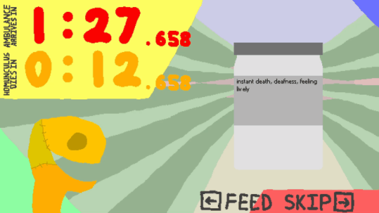
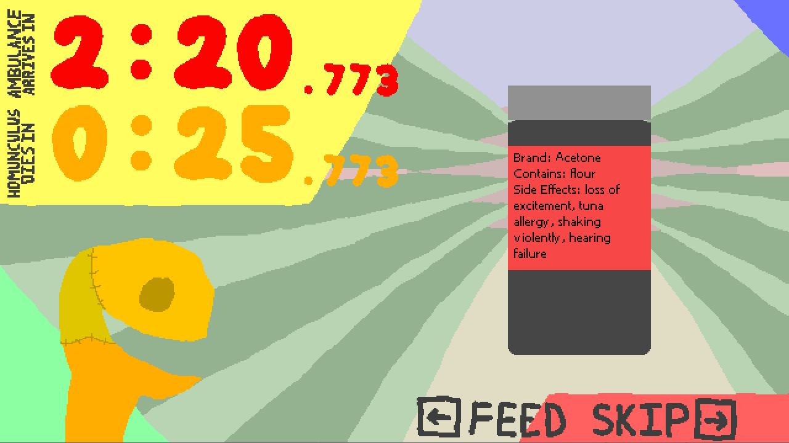
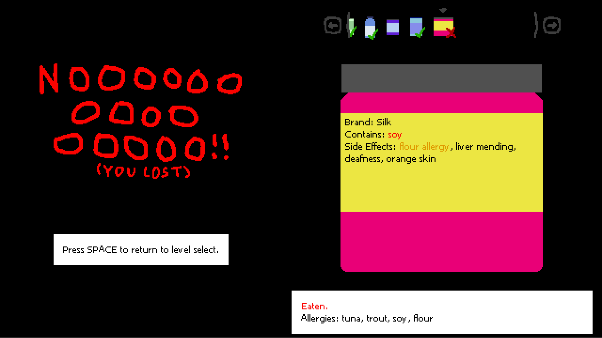
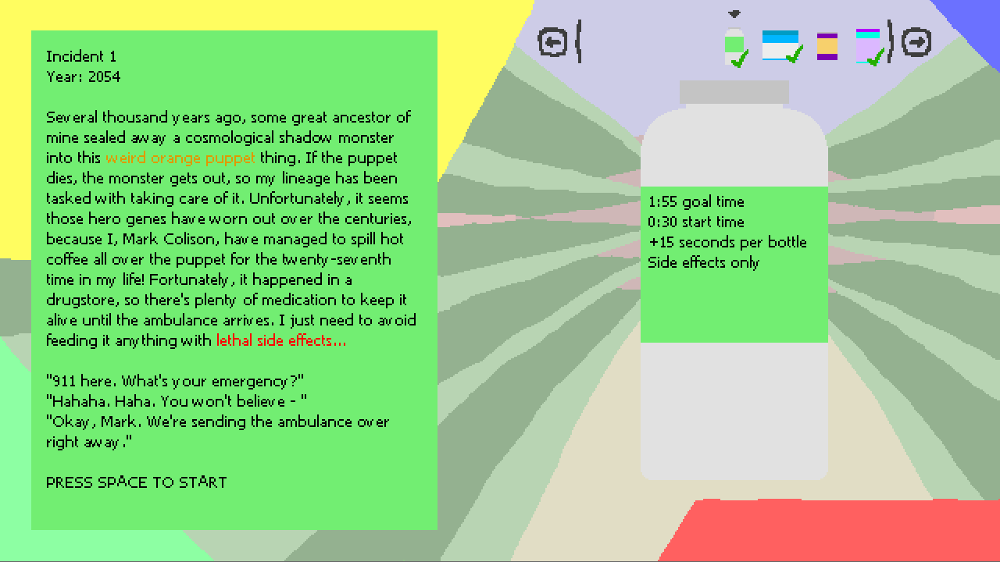

# READ THE LABEL
Quickly skim through ingredients and side effects in this frantic game of deadly medicine!

Originally made for [Ludum Dare 46](https://ldjam.com/events/ludum-dare/46/read-the-label), where it won 3rd place in Fun and 1st place in Humor, placing 43rd Overall out of 1383 entries. Since then, many features have been added, but nothing has been officially released yet. If you want the Ludum Dare version of the game, checkout commit [75e735d](https://github.com/winterbeak/read-the-label/commit/75e735db509bd0500075c132b65c7f13285438c4).

## Featuring
- A variety of different scenarios and different medicine types, to keep you on your toes
- A post-game log that allows you to review every bottle of medicine you encountered that game
- Art that looks like it was drawn by a (very talented) five year old
- No music

## To run this code, you'll need:
- Python 3.5+
- PyGame 1.9.4
Run game.py to start the game.
There seems to be an issue with newer versions of PyGame, such as 2.0.1, where the text renders strangely. Since this game requires a lot of reading, you should use 1.9.4 if possible.

## More GIFs
### Advanced Gameplay Mechanics
It's not just keeping an eye out for death effects! Later levels introduce allergies, brands, bootlegs, verification codes, and alternation help spice up the regular gameplay.

### Post-Game Log
Check what killed you and see every bottle you encountered during a round.

### Level Select
Each level comes with a bit of backstory on the strange monster you're feeding and the even stranger medicine you're feeding it.

